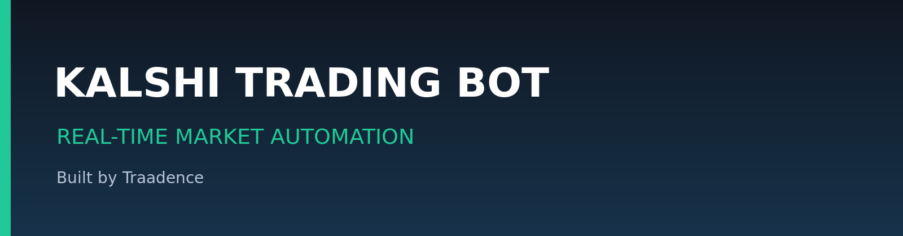
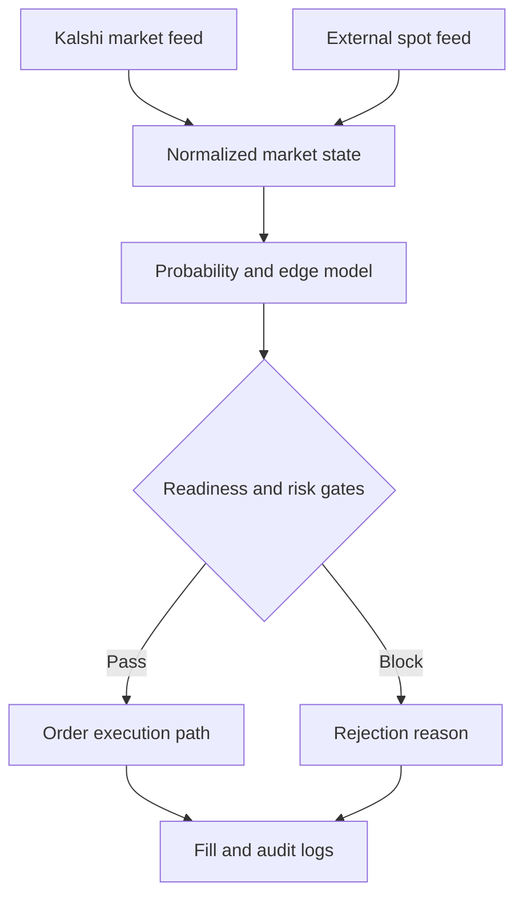
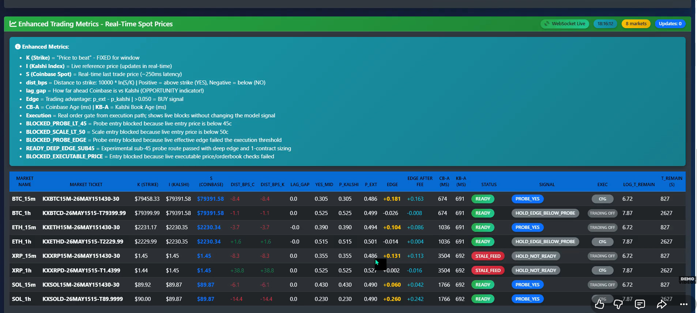
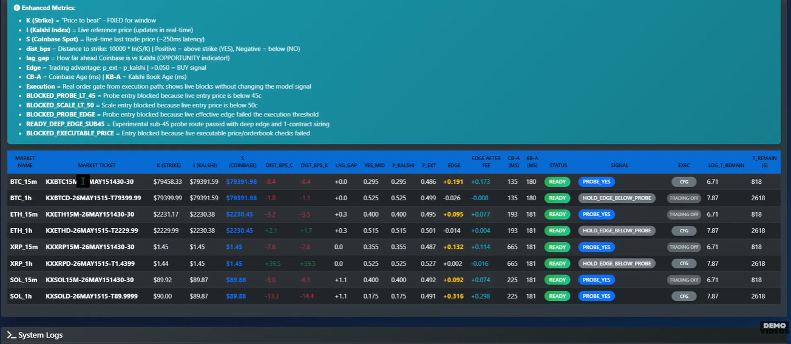
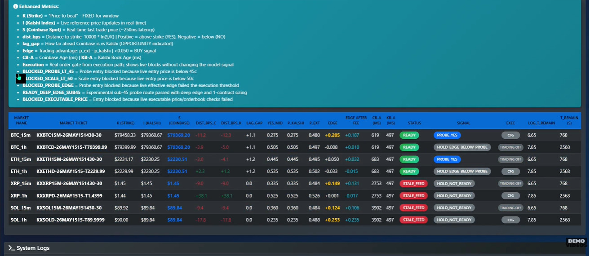
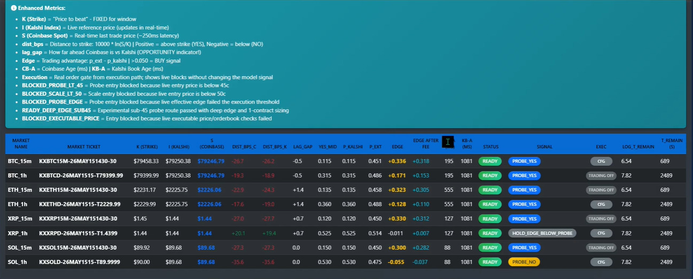
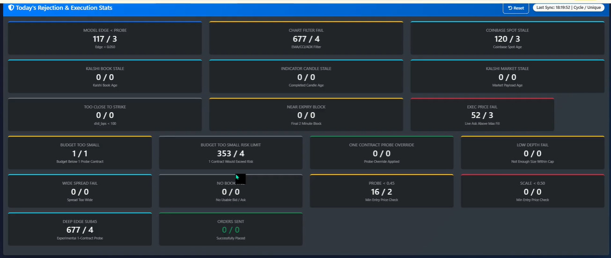
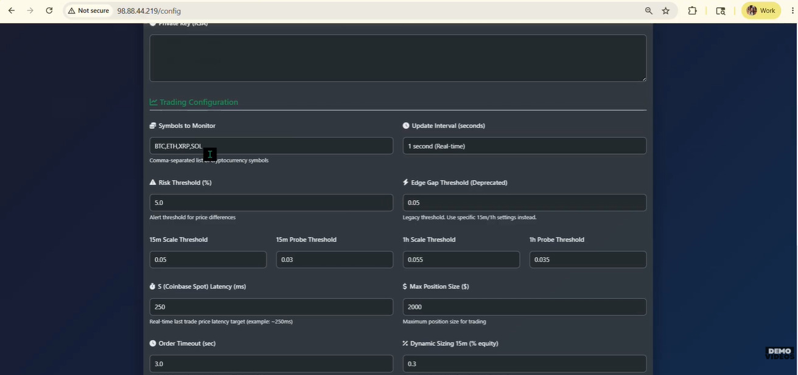

# Kalshi Trading Bot by Traadence

**A technical showcase for real-time Kalshi market monitoring, external spot-price comparison, edge detection, risk-gated execution, and operational observability.**

  

## Demo Video

**Watch on YouTube:** https://youtu.be/CGAUAZnQLO0

## Overview

This Traadence project demonstrates a monitored execution system for selected Kalshi cryptocurrency event contracts. It consumes Kalshi market data and an external Coinbase spot reference, calculates a configured probability estimate, measures potential edge, applies market-readiness and portfolio-risk gates, and records every decision for operator review.

The dashboard shown in this repository monitors BTC, ETH, XRP, and SOL contract windows. Strategy parameters and supported markets are deployment-specific; the public documentation does not disclose proprietary strategy logic, credentials, production configuration, or customer data.

## What the System Demonstrates

- Real-time Kalshi market and order-book monitoring
- External Coinbase spot-price ingestion
- Strike-distance and feed-lag measurements
- Configurable implied-probability and edge calculations
- Probe, scale, hold, and blocked execution states
- Stale-feed, price, depth, spread, budget, and risk-limit gates
- Position sizing and maximum-exposure controls
- Rejection, execution, and system-health statistics
- Centralized configuration and audit logging

## Decision Pipeline

## Dashboard Metric Guide

- **K (Strike):** contract threshold used by the selected market window.
- **I (Kalshi Index):** live reference value associated with the Kalshi contract.
- **S (Coinbase Spot):** external last-trade reference used by the configured model.
- **dist_bps:** logarithmic distance between the external spot value and strike.
- **lag_gap:** difference between the external spot and Kalshi reference values.
- **p_kalshi:** probability represented by the configured Kalshi-side price input.
- **p_ext:** probability estimated by the external model.
- **edge:** model estimate minus the Kalshi-side probability, before execution costs.
- **edge after fee:** estimated edge after configured fee assumptions.
- **CB-A / KB-A:** age of Coinbase and Kalshi market data in milliseconds.
- **status / signal / exec:** market readiness, model decision, and execution state.

An estimated edge is not guaranteed profit. Spread, fees, latency, liquidity, queue position, partial fills, rejection, settlement, and market movement can eliminate or reverse an apparent opportunity.

## Execution Gates

The system can block an order without changing the underlying model signal. Examples visible in the demonstration include:

- insufficient model edge;
- stale Coinbase or Kalshi data;
- failed executable-price or order-book validation;
- an entry price outside the configured probe or scale range;
- insufficient market depth or excessive spread;
- a risk budget too small for the requested position;
- a market too close to its final execution cutoff; and
- a disabled trading or configuration state.

## Screenshots

<table>
  <tr>
    <td width="50%"> <b>Live market overview</b></td>
    <td width="50%"> <b>Edge and latency states</b></td>
  </tr>
  <tr>
    <td width="50%"> <b>Readiness and stale-feed gates</b></td>
    <td width="50%"> <b>Probe, hold, and blocked signals</b></td>
  </tr>
  <tr>
    <td width="50%"> <b>Rejection and execution statistics</b></td>
    <td width="50%"> <b>Strategy and risk configuration</b></td>
  </tr>
</table>

## Repository Scope

This is a documentation and product-showcase repository. It intentionally excludes production source code, live API credentials, signing keys, account data, private model rules, and deployment secrets.

## Traadence

Traadence builds custom trading bots, execution engines, backtesting systems, market-data infrastructure, and trading dashboards.

**Website:** https://www.traadence.com/

**Demo:** https://youtu.be/CGAUAZnQLO0
